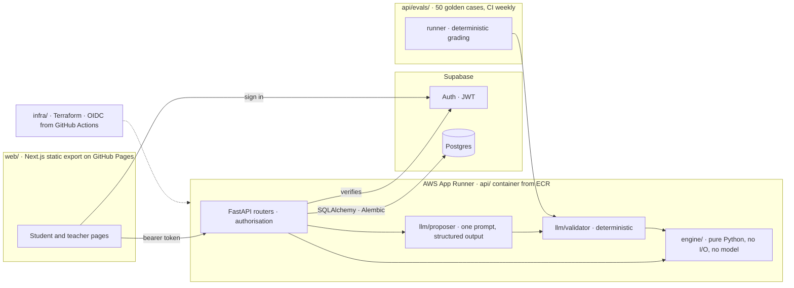

# Chops Buddy

A music practice and teaching platform for instrumental teachers and their students. The student side turns a teacher's assignments into a guided practice session, the way a programmed gym session guides a lifter. The teacher side is a small CRM for itinerant teachers working across several schools.

**Status: v0.1 feature-complete, release pending.** Scope and the finish line are fixed in [docs/DEFINITION_OF_DONE.md](docs/DEFINITION_OF_DONE.md); progress against it is in [docs/RELEASE_CHECKLIST.md](docs/RELEASE_CHECKLIST.md). Every design choice is in [docs/DECISIONS.md](docs/DECISIONS.md).

## Eval results

The model's one job is to propose the next session's minute allocation, deferrals, and wording; a deterministic validator checks every proposal against the methodology and repairs or rejects it. Fifty golden cases in `api/evals/cases/` grade the model's intent; results are appended to `api/evals/results/` and never edited. Regressions stay in the table.

<!-- evals:start -->
No runs yet.
<!-- evals:end -->

## Architecture



Three boundaries the design protects:

- `engine/` imports nothing from the API, database, or model layers and has no I/O. It works with the model absent. Every rule in [docs/ENGINE_SPEC.md](docs/ENGINE_SPEC.md) has a named test.
- The model may only choose minutes, deferrals, and words. Mode, tempo, fragment, and threshold are the engine's, because a prescription that differs from the engine's state cannot be logged (rule E-21).
- The database stores engine shapes as JSONB snapshots of the engine's own models, never re-modelled as columns.

## Why this exists

The pedagogy is the point. It is written down in [docs/pedagogy/](docs/pedagogy/) and encoded as a deterministic engine: repetition thresholds, slow-on-failure, fragment isolation, a tempo ladder, and backwards chaining.

One narrow LLM task sits above it and is measured by a published eval suite whose results, including regressions, are committed to this repo.

## Layout

| Path | What |
|---|---|
| `api/src/chops_buddy/engine/` | The practice engine. Spec: `docs/ENGINE_SPEC.md` |
| `api/src/chops_buddy/llm/` | Proposal schema, validator, prompt and model client |
| `api/src/chops_buddy/api/` | FastAPI: auth, services, routers (student, teacher, CRM) |
| `api/src/chops_buddy/db/` | SQLAlchemy models; `api/migrations/` Alembic. Model: `docs/DATA_MODEL.md` |
| `api/evals/` | Golden cases, runner, results |
| `web/` | Next.js client |
| `infra/` | Terraform for ECR, App Runner, IAM, SSM |
| `.github/workflows/` | `ci` (tests, evals), `deploy` (image, terraform, release), `pages` (client) |

## Running locally

API, with an embedded Postgres for tests (no Docker needed):

```bash
cd api && python3.11 -m venv .venv && source .venv/bin/activate && pip install -e '.[dev]'
pytest                                   # embedded Postgres, no setup
CB_DATABASE_URL=... CB_SUPABASE_JWT_SECRET=... uvicorn chops_buddy.api.main:app --reload
python -m chops_buddy.seed               # demo school, 2 teachers, 6 students, 30 days of logs
CB_LLM_API_KEY=... python -m evals --write && python evals/report.py
```

Client:

```bash
cd web && cp .env.example .env.local && npm install && npm run dev
```

## Related

- [Woodshed](https://github.com/mkou135/woodshed): the same engineering pattern (deterministic core, optional model layer, published spec, decision log) applied to jazz solo analysis.
